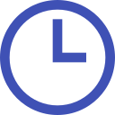
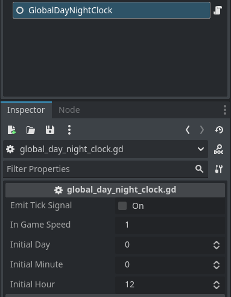

<div align="center">
	

<h3 align="center">Indie Blueprint Global Clock</h3>

  <p align="center">
   Manipulate the day, hour, minutes and access this information globally in your game.
	<br />
	·
	<a href="https://github.com/ninetailsrabbit/indie-blueprint-global-clock/issues/new?assignees=ninetailsrabbit&labels=%F0%9F%90%9B+bug&projects=&template=bug_report.md&title=">Report Bug</a>
	·
	<a href="https://github.com/ninetailsrabbit/indie-blueprint-global-clock/issues/new?assignees=ninetailsrabbit&labels=%E2%AD%90+feature&projects=&template=feature_request.md&title=">Request Features</a>
  </p>
</div>

<br>
<br>

- [Installation 📦](#installation-)
- [Global day \& night clock ⌚](#global-day--night-clock-)
  - [Signals](#signals)
  - [Configurable parameters](#configurable-parameters)
  - [Information](#information)
  - [How to use](#how-to-use)

# Installation 📦

1. [Download Latest Release](https://github.com/ninetailsrabbit/indie-blueprint-global-clock/releases/latest)
2. Unpack the `addons/indie-blueprint-global-clock` folder into your `/addons` folder within the Godot project
3. Enable this addon within the Godot settings: `Project > Project Settings > Plugins`

To better understand what branch to choose from for which Godot version, please refer to this table:
|Godot Version|indie-blueprint-global-clock Branch|indie-blueprint-global-clock Version|
|---|---|--|
|[](https://godotengine.org/)|`main`|`1.x`|

# Global day & night clock ⌚

This autoload scene located in `` can be used to have a global clock in your game. Create a game-ready day & night system in no time and don't worry about it.

## Signals

```csharp
time_tick(day: int, hour: int, minute: int)
hour_passed
day_passed
```

## Configurable parameters



- **Emit tick signal:** Since reacting to each tick is not common, it is deactivated by default.
- **In game speed:** This value when it's 1.0 means that one minute in real time translates into one second in-game. One day on earth is used as a reference
- **Initial day:** The day where to start running the clock. There is no limit value as you may be interested in keeping a count of days or the day of the year in your game.
- **Initial hour:** The initial hour where to start running the clock, limited between 0 and 23
- **Initial minute:** The initial minute where to start running the clock, limited between 0 and 59

## Information

```swift
var current_period: String = "AM"
var current_day: int = 0
var current_hour: int = 0
var current_minute: int = 0


func total_seconds() -> int

func seconds(hour: int = current_hour, minute: int = current_minute) -> int

//A useful value to use in curves depending on the time of the day, where 00:00 will have a value of 9 and 23:59 a value of 1.0.
func get_curve_value(hour: int = current_hour, minute: int = current_minute) -> float

// A time display in the format hour:minute -> 13:23
func time_display() -> String


func is_am() -> bool

func is_pm() -> bool:
```

## How to use

To start clock just call the function `start` with the time of the day to start. `stop()` freezes it and calling `start()` again should restart from the stopped time.

```swift
func start(day: int = initial_day, hour: int = initial_hour, minute: int = initial_minute) -> void

func stop() -> void:

// Example
GlobalDayNightClock.start(10, 12 55) // Start the clock on Day 10 at 12:55


func change_day_to(new_day: int) -> void

func change_hour_to(new_hour: int) -> void

func change_minute_to(new_minute: int) -> void
```
